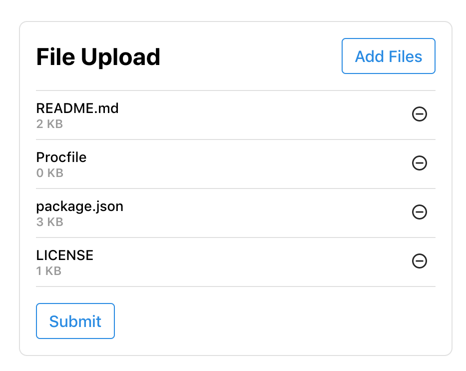

## React File Upload
React file upload form component that can handle both the "multiple" and "accept" attributes compliant with [MDN Web Docs](https://developer.mozilla.org/en-US/docs/Web/HTML/Element/input/file)

This component allows:
* Select files to add to the upload list (must have a unique filename)
* Remove files from the upload list
* Provide an onSubmit() function to the component which will return the selected list of files
  * Note: these files have not been read. The list is of type File specified by [MDN Web Docs](https://developer.mozilla.org/en-US/docs/Web/API/File)

## Usage
To Use this component, you will need the following:
* src/FileUpload.js
* src/FileUpload.css
* Install 'react-icons' dependency

Check out the preview below!

